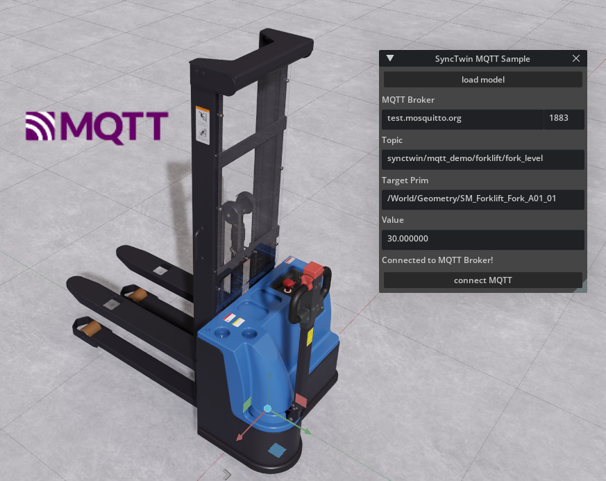

# SyncTwin MQTT Example 

An example to control a digital twin asset with an MQTT subscription. 

see a tutorial on the code here : https://medium.com/@mtw75/how-to-control-a-digital-twin-asset-with-mqtt-in-nvidia-omniverse-92382e92e4dc

for more information visit https://www.synctwin.ai
